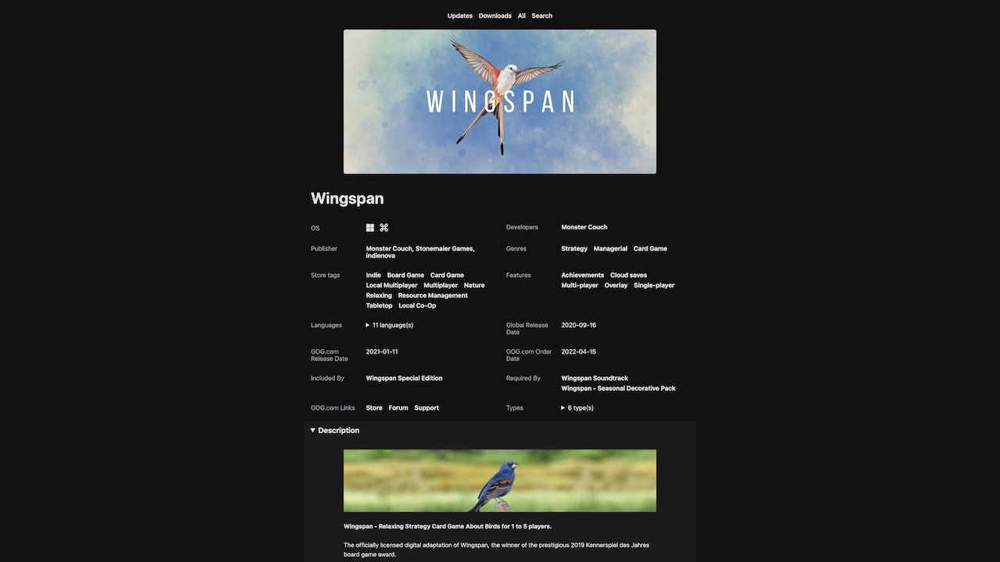
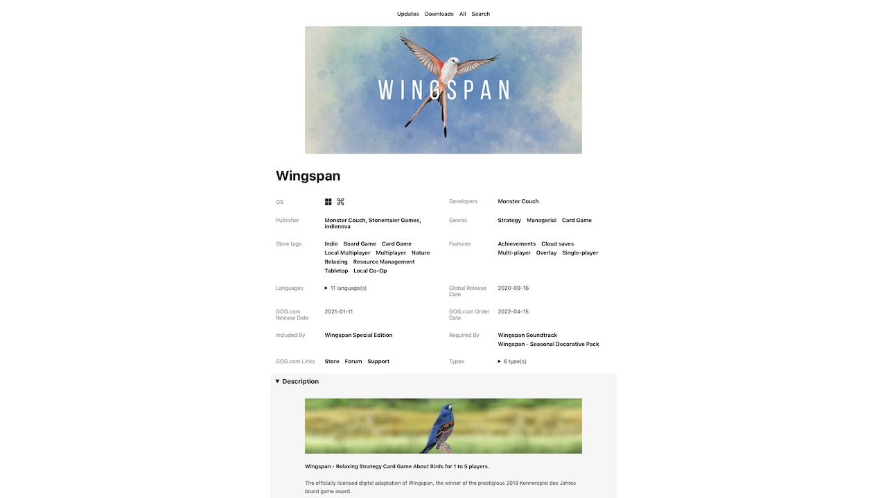
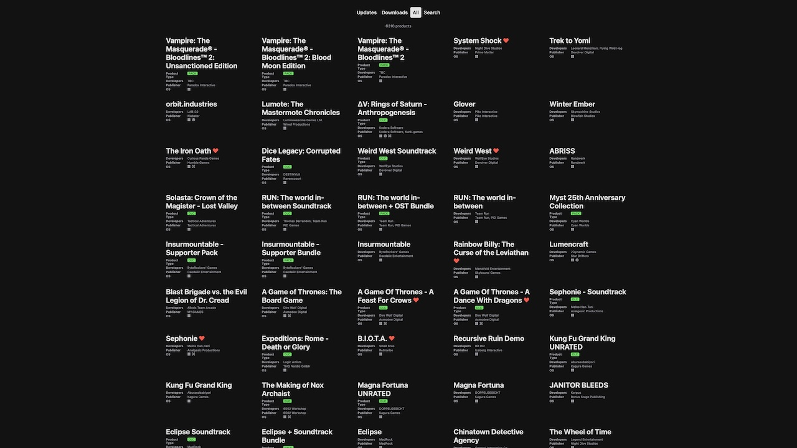
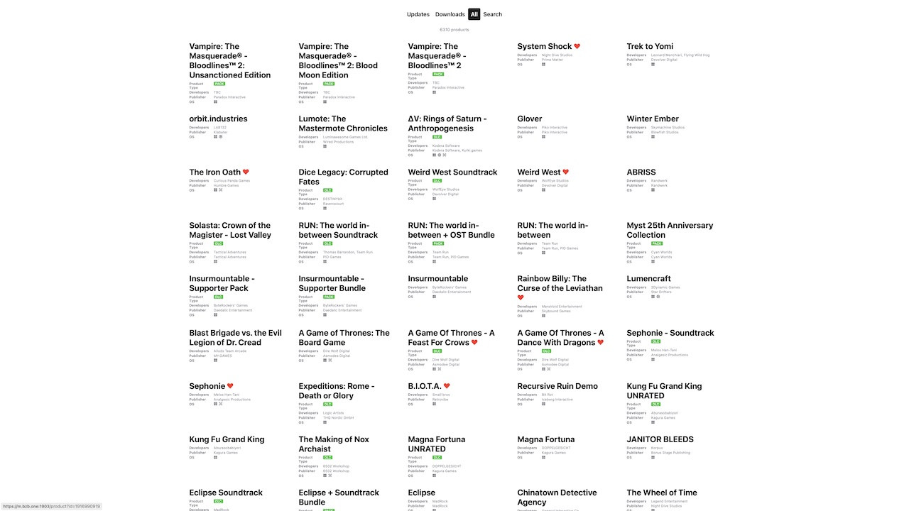

# gaugin

Frontend microservice for [arelate/vangogh](https://github.com/arelate/vangogh) that provides UI to browse your GOG.com data.

## Installation

The recommended way to install `gaugin` is with docker-compose:

create a `docker-compose.yaml` file (this minimal example omits common settings like network, restart, etc):

```yaml
version: '3'
services:
  gaugin:
    container_name: gaugin
    image: ghcr.io/arelate/gaugin:latest
    environment:
      # scheme to use for vangogh connection
      - GG_SERVE_VANGOGH_SCHEME=https
      # vangogh address
      - GG_SERVE_VANGOGH_ADDRESS=vangogh.example
      # vangogh port (1853 is the default)
      - GG_SERVE_VANGOGH_PORT=1853
      # OS to use for downloads display
      - GG_SERVE_OPERATING_SYSTEM=windows
      # language codes to use for downloads display
      - GG_SERVE_LANGUAGE_CODE=en
      # use this username to allow downloads access
      - GG_SERVE_USERNAME=admin
      # use this password to allow downloads access
      - GG_SERVE_PASSWORD=password
    volumes:
      # vangogh artifacts: checksums, images, metadata, recycle_bin, videos
      - /docker/vangogh:/var/lib/vangogh:ro
    ports:
      # https://en.wikipedia.org/wiki/Paul_Gauguin
      - "1848:1848"
```

NOTE: `gaugin` needs direct access to digital files fetched by `vangogh` (images, videos, downloads). While `gaugin` doesn't need to run on the same server, it's recommended for easier configuration. Mounting remote `vangogh` volume is out of scope for this document. 

- (move it to location of your choice, e.g. `/docker/gaugin` or remote server or anywhere else)
- while in the directory with that config - pull the image with `docker-compose pull`
- start the service with `docker-compose up -d`

## Usage

Assuming you have vangogh setup correctly and data is available - to use `gaugin` open your browser and navigate to the address of the server you've deployed `gaugin` to, e.g. `https://gaugin.example:1848`. Modern browser with support for [`content-visibility`](https://caniuse.com/?search=content-visibility) and other performance features is highly recommended to use `gaugin`.

## Screenshots

| Section | Dark theme                                        | Light theme                                         |
|---------|---------------------------------------------------|-----------------------------------------------------|
| Details |  |  |
| All     |          |          |
| Sale    |        |        |     

## Sharing games

`gaugin` assumes you follow GOG.com [games sharing guidelines](https://support.gog.com/hc/en-us/articles/212184489-Can-I-share-games-with-others-?product=gog). Just like GOG.com, we trust you that this will not be abused.
